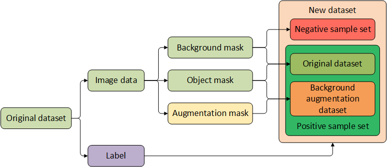
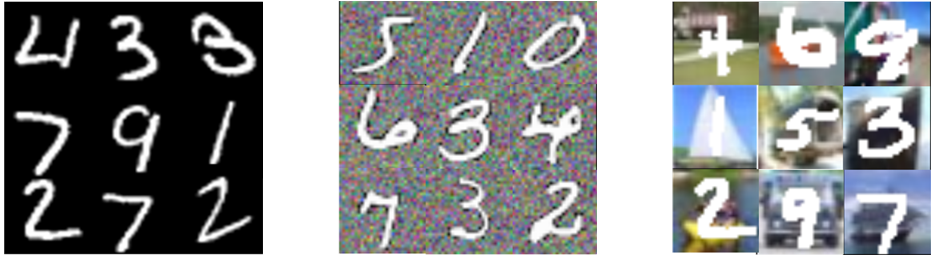

# Test the Influence of Task-Irrelevant Factors on Neural network inference performance

The preprocessing method of MINST dataset is as follows:

Three types of data sets can be obtained. (a) is the
original MINST dataset, which is used for training and testing. (b) is
the background augmentation MINST dataset, which is used for training
and testing. (c) is the MINST dataset mixed with the CIFAR-10 dataset,
which is only used for testing.

getData.py：training data, including synthetic Gaussian 
background augmentation data and data with real image as background. 
However, in order to unify the batch size and facilitate coding, 
this file is not directly used for Gaussian background augmentation 
during training